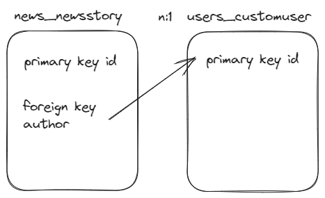

# Tracey Nguyen: Django Project - She Codes News Website

## About This Project 

This Django project showcases a website for news articles. 

## How to Run This Code
- 

## Database Schema

## Project Features
- [X] Order stories by date
- [X] Styled "new story" form
- [X] Story images
- [X] Log-in/log-out
- [ ] "Account view" page
- [X] "Create Account" page
- [X] View stories by author
- [X] "Log-in" button only visible when no user is logged in/"Log-out" buttononly visible when a user *is* logged in
- [X] "Create Story" functionality only available when user is logged in

## Additional Features:
- [X] Add categories to the stories and allow the user to search for stories bycategory.
- [X] Add the ability to update and delete stories (consider permissions - who should be allowed to update or and/or delete stories).
- [ ] Add the ability to “favourite” stories and see a page with your favourite stories.
- [X] Our form for creating stories requires you to add the publication date,update this to automatically save the publication date as the day the story was first published (maybe you could then add a field to show when the story was updated).
- [X] Gracefully handle the error where someone tries to create a new story whenthey are not logged in.

## High Level Flow of Project

- News articles can be displayed with latest stories shown as the highlight on the main index page
- Search can be completed without login
- When a user is logged in, features enabled include: 
    - create, edit, delete stories belonging to them (admin can edit/delete for any user)
    - edit user profile
 
## Wireframe

Functionality that has been provided includes:
- [X] Ordered stories by latest date
- [X] CSS styling for webpages
- [X] Adding a form to:
    - [X] create, edit, delete new stories
    - [X] create, edit, view user
- [X] Adding a field to store image URLs
- [X] Functional login/logout buttons
- [X] Search stories to view by a particular author (first/last name) or category
- [X] Show/hide relevant information, features based on whether user is logged in
- [X] Categories added for news articles
- [X] Publication date on create is automatically captured without user input when user creates news article
- [X] Last updated date is automatically captured without user input when user edits news article
- [X] Handle error when someone tries to create a new story when they are not logged in

## Future functionality/improvements

Additional features that were considered but not yet implemented:
- comments for news articles
- using media for to store image uploads
- enable user to favourite news articles and display/edit favourites
 