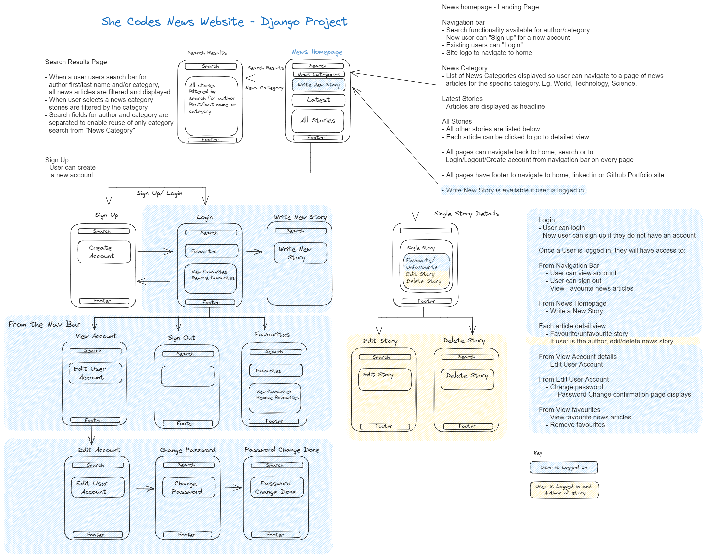

# Tracey Nguyen: Django Project - She Codes News Website

## About This Project 

This Django project showcases a website for news articles. 

### High Level Overview of Project

- A News website has been created with Django with a local sqlite3 database. 
- Two apps have been created within the site - News and Users
- News app manages story viewing, creation, deletion
- Users app manages authentication, account management (view, edit)
- News articles can be displayed with latest stories shown as the highlight on the main index page
- Search can be completed without login from the navigation bar on each page
- New users can sign up for an account
- When a user is logged in, features enabled include: 
    - create, edit, delete stories belonging to them (admin can edit/delete for any user)
    - view, edit user profile
    - change password
    - favourite a story
    - view and remove favourites

## How to Run This Code
- 

## Database Schema

## Project Features
- [X] Order stories by date
- [X] Styled "new story" form
- [X] Story images
- [X] Log-in/log-out
- [X] "Account view" page
- [X] "Create Account" page
- [X] View stories by author
- [X] "Log-in" button only visible when no user is logged in/"Log-out" buttononly visible when a user *is* logged in
- [X] "Create Story" functionality only available when user is logged in

## Additional Features:
- [X] Add categories to the stories and allow the user to search for stories bycategory.
- [X] Add the ability to update and delete stories (consider permissions - who should be allowed to update or and/or delete stories).
- [X] Add the ability to “favourite” stories and see a page with your favourite stories.
- [X] Our form for creating stories requires you to add the publication date,update this to automatically save the publication date as the day the story was first published (maybe you could then add a field to show when the story was updated).
- [X] Gracefully handle the error where someone tries to create a new story whenthey are not logged in.

 
## Wireframe

## Future functionality/improvements

Additional features that were considered but not yet implemented:
- Comments for news articles
- Weather feature
- Personalisation of location of user to show weather for location
- User profile can load image for avatar

 