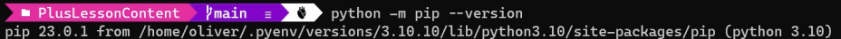
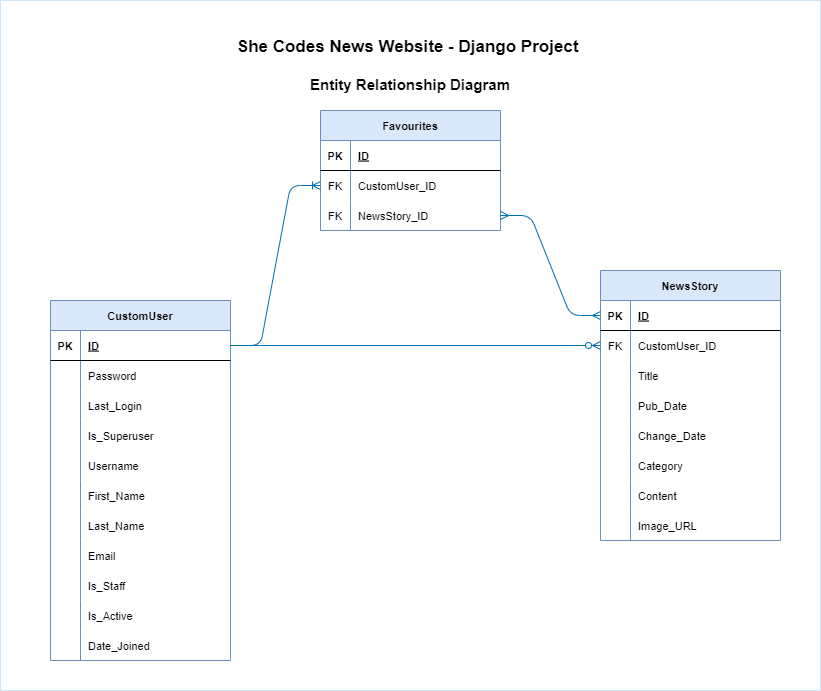
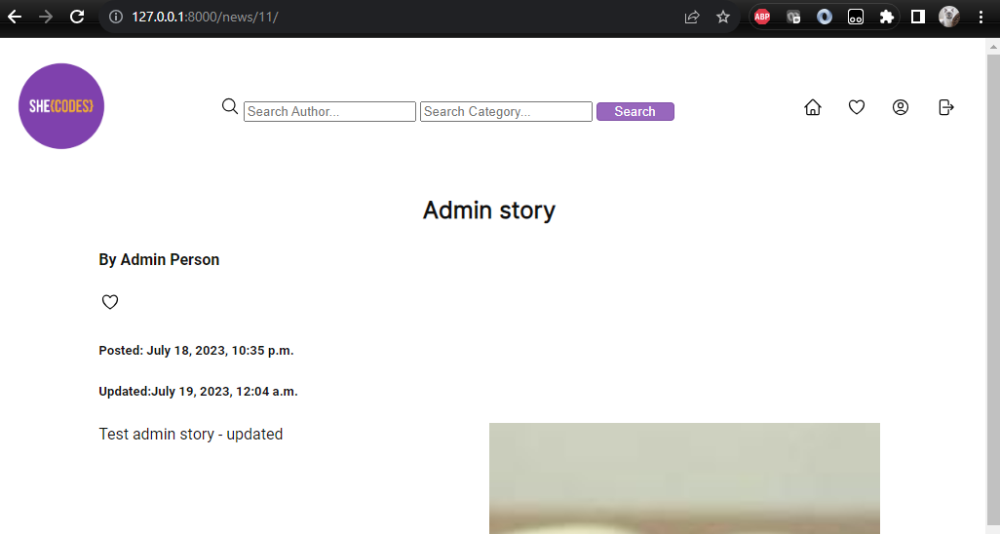

# Tracey Nguyen: Django Project - She Codes News Website

## About This Project 

This Django project showcases a website for news articles. 

### High Level Overview of Project

- A News website has been created with Django with a local sqlite3 database. 
- Two apps have been created within the site - News and Users
- News app manages story viewing, creation, deletion
- Users app manages authentication, account management (view, edit)
- News articles can be displayed with latest stories shown as the highlight on the main index page
- Search can be completed without login from the navigation bar on each page
- New users can sign up for an account
- When a user is logged in, features enabled include: 
    - create, edit, delete stories belonging to them (admin can edit/delete for any user)
    - view, edit user profile
    - change password
    - favourite a story
    - view and remove favourites
    - sign out

## How to Run This Code
- An overview of Django setup is below
- Root directory is she_codes_news
- Apps are hosted in subdirectory referenced as she_codes_news = she_codes_news/she_codes_news/ 
- All other directories are referenced from root she_codes_news main directory

### Initial setup 
Step | Location | Command | Screenshots 
| :--- | :--- | :--- | :---
Clone template code for project | github | https://github.com/SheCodesAus/plus-django-news-project-template |  
Copy repo and rename to your own repo | github | Click "Use this template" and select name - "she_codes_news" | 
Go to your new Github repo created | github | Click "Code" button to get url to clone |  
Go to terminal | root | git clone <your_link_goes_here> |
Check pip version | Root | python -m pip --version | 
Install pip version (if required/no version found) | Root | python -m ensurepip --upgrade | 
Create virtual environment | Root | python -m venv venv | 
Activate virtual environment | Root | . venv/Scripts/activate |
Install Django library requirements | Root | python -m pip install -r requirements.txt |
Check installation successful | Root | python -m pip freeze | 
Launch VS code | VS code | code . | 
Make initial migrations | /she_codes_news | cd she_codes_news   python manage.py migrate | 
Run local web server | /she codes_news | python manage.py runserver |  
URL to launch main She Codes News Website homepage | /she codes_news | http://127.0.0.1:8000/news | Website loads
 

### Run Each Time for Local Web Server 
- This will be run in root directory she_codes_news where requirements.txt file is stored

Step | Location | Command |  
| :--- | :--- | :--- 
Activate virtual environment | Root | . venv/Scripts/activate
Run local web server | /she codes_news | python manage.py runserver
URL to launch main She Codes News Website homepage | http://127.0.0.1:8000/news
Turn off virtual environment | Root | deactivate 

## Database Schema

There are 3 database tables: 
- NewsStory - store the news stories, author, published date, content, image
- CustomUser - store the registered user account information
- Favourites - stores the user and news article that has been set as a favourite

## Project Features
- [X] Order stories by latest date under "Latest News" section
    - Stories ordered by date descending for the latest updated 4 stories

    

- [X] Styled "new story" form
    - Mandatory fields: Title, category, URL, content

    

- [X] Story images
    - User can create story with a url for image
    - When image cannot be found, a default image is displayed
    - The field is mandatory and validated against URL format
 
        

- [X] Log-in/log-out
    - Login page for user to enter username and password
    - User can also "Sign up" if they do not have a login account
    - User is taken back to news homepage with updated nav bar
    - User can sign out from nav bar from sign out icon and is taken back to news homepage

    
        

- [X] "Account view" page
    - User can view account details
    - User can edit account from "View Account" page
    -   User can change password from the "Edit Account" page
        - User will be sent to password change completed page after password change

        
        
        
        

- [X] "Create Account" page
    - User can click on "Sign Up" from nav bar to create account 
    - User is taken to "Login" page after account created

            

- [X] View stories by author
    - Separate search field for author from category search to enable reuse of specific category search
    - Search will return a "Search Results" page
    - Search results will search either first or last name of author based on icontains filter
    - Search results will search in addition to author first/last name with category if entered
    - Search results will search only category if no author entered based on icontains filter
    - Search results will display no results available if no match found on criteria entered
    - No login required for search functionality

        
        
       
               
        

- [X] "Log-in" button only visible when no user is logged in/"Log-out" button only visible when a user *is* logged in

    
        

- [X] "Create Story" functionality only available when user is logged in
    - "Add New Story" button is only displayed after user is logged in under the news category header section of the news homepage

       
            

## Additional Features:
- [X] Add categories to the stories and allow the user to search for stories by category.
    - New story creation has a category drop down based on choices
    - News categories are displayed as links on the homepage under the header section
    - Separate search field for category from search by author to enable the News Category to reuse the search filter by category to show a search results page for   specific category selected.    
    - Search is managed with icontains filter for query 
    - No search results displayed if no results

        
    
    
    
        
        

- [X] Add the ability to update and delete stories (consider permissions - who should be allowed to update or and/or delete stories).
    - A user can update/ delete a story if they are the author of the story
    - A superuser/ admin can also update/ delete a story of another user
    - From the single story page, option appears to edit/ delete story via the pencil icon to edit story and bin icon to delete story
    - Favourites icon is also displayed, outline heart icon or solid heart icon, depending if user has favourited story 

    
    
    

- [X] Add the ability to “favourite” stories and see a page with your favourite stories.
    - When user is logged in, user can favourite/ unfavourite story from a single story detail view by clicking the heart icon
    - Favourites icon will be displayed as outline heart icon or solid heart icon, depending if user has favourited story 
    - From navigation bar, heart icon allows user to go to "Favourite News" page to view all favourites and remove favourites

    
    
        

- [X] Our form for creating stories requires you to add the publication date,update this to automatically save the publication date as the day the story was first published (maybe you could then add a field to show when the story was updated).
    - Publication date is saved automatically on creation of new story
    - Changed date is saved automatically when a story is updated
    - These fields are not displayed on "New Story" creation or on "Edit Story" as they are automatically updated

    

- [X] Gracefully handle the error where someone tries to create a new story whenthey are not logged in.
    - If a user is not authenticated for a page, they are redirected to the login page which also has a link to Sign up if the user does not have an account

    

 
## Wireframe

A high level flow of the website functionality is provided below.

## Future functionality/improvements

Additional features not yet implemented:
- Comments for news articles
- Weather feature
- Personalisation of location of user to show weather for location
- User profile can load image for avatar

 